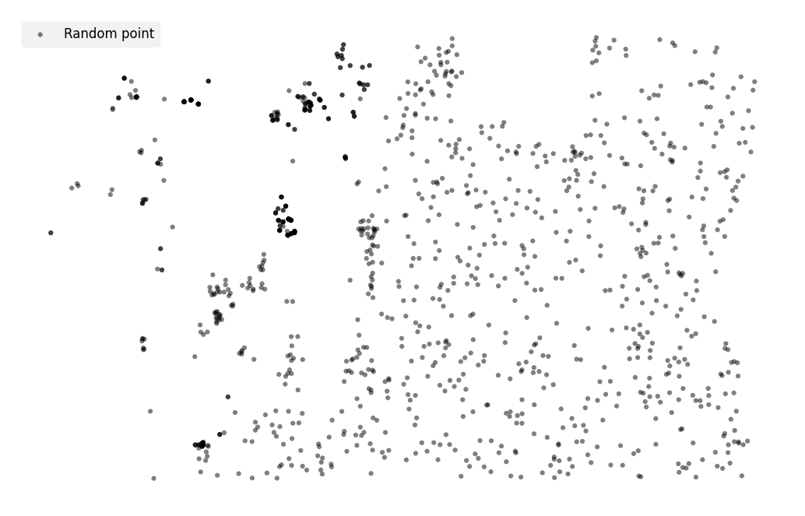
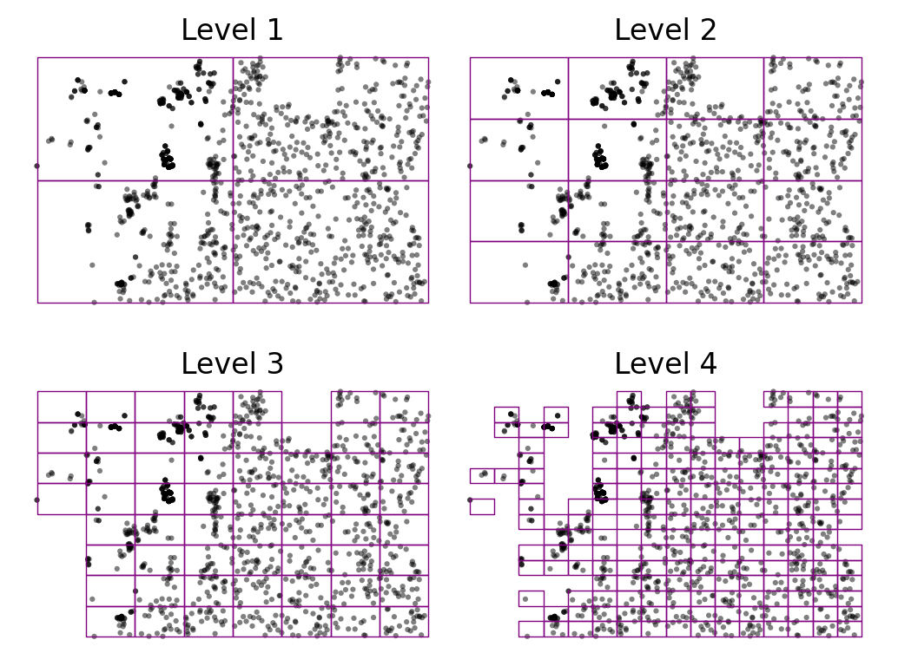
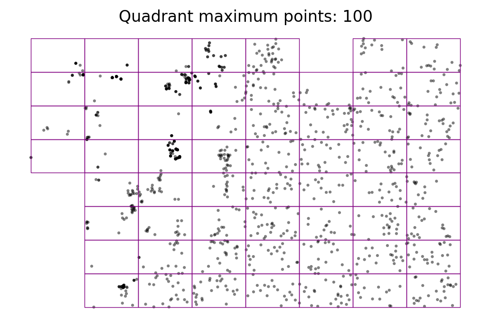
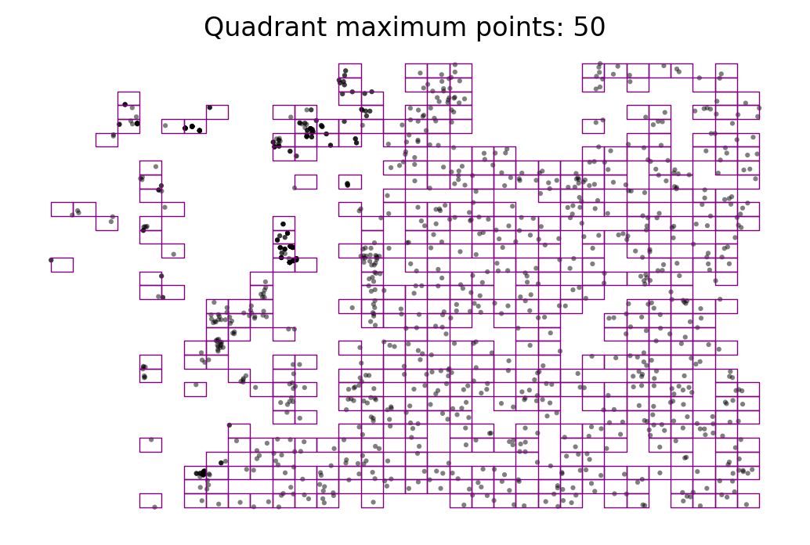
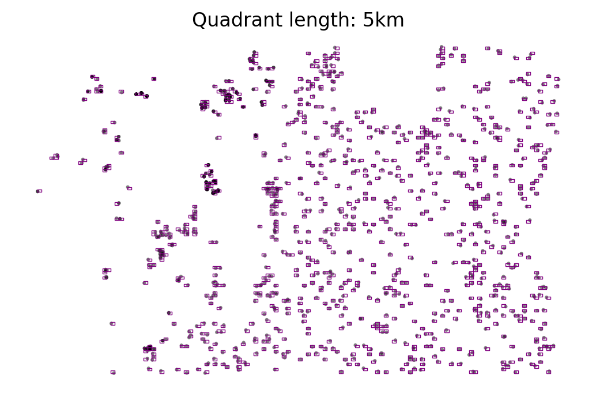
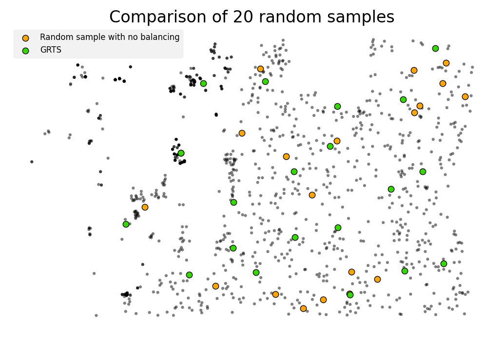
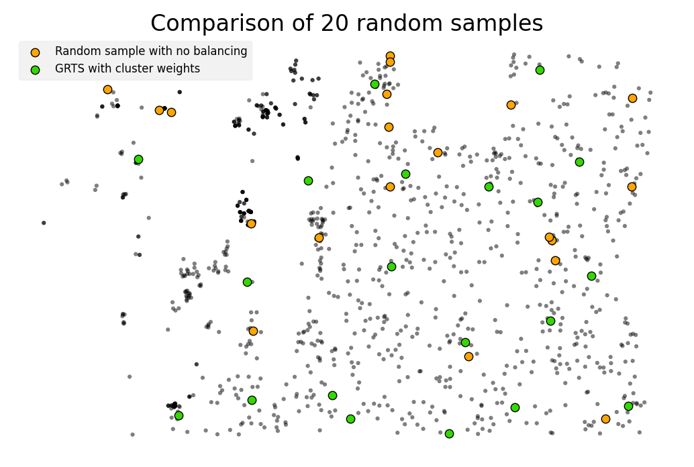

[](https://lbesson.mit-license.org/)
[](https://img.shields.io/badge/python-3.6%20%7C%203.7%20%7C%203.8%20%7C%203.9%20%7C%20-blue)


# GeoSample is a library for geospatial sampling

Use GeoSample to generate random samples that are spatially balanced using the Generalized Random Tessellation Stratified (GRTS) method.

#### What is GRTS?

> A sampling approach that maps 2-dimensional samples onto a 1-dimensional plane, sorted by base 4 hierarchical grid ids. See Stevens and Olsen (2004) for details on the method. Slides outlining the method can be found [here](https://archive.epa.gov/nheerl/arm/web/pdf/grts_ss.pdf) and [here](https://qcnrgradstudentcouncil.files.wordpress.com/2012/12/ecolunch_grts.pdf). The [`grts` R library](https://rdrr.io/cran/spsurvey/man/grts.html) provides a more in-depth GRTS framework.

```bibtex
@article{stevens_olsen_2004,
  title={Spatially balanced sampling of natural resources},
  author={Stevens Jr, Don L and Olsen, Anthony R},
  journal={Journal of the American statistical Association},
  volume={99},
  number={465},
  pages={262--278},
  year={2004},
  publisher={Taylor \& Francis}
}
```

# Basic example

```python
>>> from geosample import QuadTree
>>> import geopandas as gpd
>>>
>>> samples = gpd.read_file('samples.gpkg')
>>>
>>> qt = QuadTree(samples)
>>>
>>> # Split until the quadrants are less than 5,000 meters
>>> qt.split_recursive(max_length=5000)
>>>
>>> # Get the actual quadrant length
>>> qt.qlen
>>>
>>> # Get the quadrants as a GeoDataFrame
>>> df = qt.to_frame()
>>>
>>> # Get 5 random points using the Generalized Random Tessellation Stratified (GRTS) method
>>> dfs = qt.sample(n=5)
```

# Examples

## Start with random samples



## Split the tree recursively

```python
>>> qt = QuadTree(df)
>>>
>>> for i in range(0, 4):
>>>     qt.split()
```



## Split until maximum number of points in each quadrant

```python
>>> qt = QuadTree(df)
>>> qt.split_recursive(max_samples=100)
```



```python
>>> qt = QuadTree(df)
>>> qt.split_recursive(max_samples=50)
```



## Split until maximum quadrant length

```python
>>> qt = QuadTree(df)
>>> qt.split_recursive(max_length=5000)
```



# Spatially balanced sampling

## Generalized Random Tessellation Stratified (GRTS)

```python
>>> qt = QuadTree(df)
>>> qt.split_recursive(max_length=10000)
>>> n_samples = 20
>>>
>>> df.sample(n=n_samples, replace=False).plot(markersize=20,
>>>                                            color='orange',
>>>                                            edgecolor='k',
>>>                                            lw=0.5,
>>>                                            label='Random sample with no balancing')
>>>
>>> qt.sample(n=n_samples).plot(markersize=20, color='#34d800', edgecolor='k', lw=0.5, label='GRTS')
```



## Generalized Random Tessellation Stratified (GRTS) with cluster center weights

```python
>>> qt = QuadTree(df)
>>> qt.split_recursive(max_length=10000)
>>> n_samples = 20
>>>
>>> df.sample(n=n_samples, replace=False).plot(markersize=20,
>>>                                            color='orange',
>>>                                            edgecolor='k',
>>>                                            lw=0.5,
>>>                                            label='Random sample with no balancing')
>>>
>>> qt.sample(n=n_samples,
>>>           weight_by_clusters=True).plot(markersize=20, color='#34d800', edgecolor='k', lw=0.5, label='GRTS')
```


